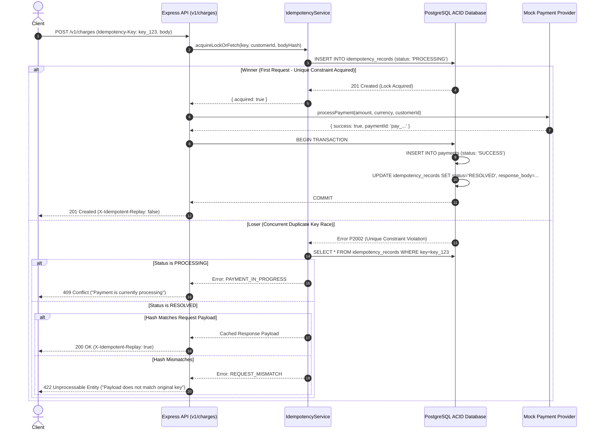

# 🛡️ Production Idempotent Payment Gateway

A production-grade, distributed idempotent payment gateway API and real-time visualization dashboard designed to guarantee **Zero Duplicate Payments** under high-concurrency network retries, connection drops, and race conditions.

---

## 🏗️ Architecture & Concurrency Mechanism



---

## 🔑 Core Guarantees & Features

1. **Zero Duplicate Payments via DB Constraints**:
   - Uses a PostgreSQL compound unique constraint: `@@unique([customerId, key])`.
   - No fragile in-memory maps or single-point-of-failure Node.js memory state.
2. **Deterministic Payload Hashing**:
   - Computes `SHA-256(amount + currency + customerId)` to ensure key reuse with different amounts is immediately rejected with `422 Unprocessable Entity`.
3. **In-Flight Protection (409 Conflict)**:
   - When a concurrent identical request arrives while the first is still processing downstream, it receives `409 Conflict` with `PAYMENT_IN_PROGRESS`.
4. **Stripe-Style Cached Replay**:
   - Once resolved, repeated requests with the same key instantly return the cached 200 OK response with `X-Idempotent-Replay: true`.
5. **Interactive Concurrency Visualizer**:
   - React + Vite dashboard capable of firing 5–100 concurrent requests via `Promise.all()` with live dot-grid state transitions.

---

## 🚀 Quick Start with Docker

```bash
# 1. Clone repository and start Docker Compose
docker compose up -d

# 2. Start frontend dev server
cd frontend
npm install
npm run dev
```

Visit the dashboard at `http://localhost:5173`.

---

## 🛠️ Local Development & Testing

### Prerequisites
- Node.js 18+
- PostgreSQL 15+ running on port 5432

### Backend Setup
```bash
cd backend
npm install
npx prisma migrate dev --name init
npm run dev
```

### Running Test Suite
```bash
# Run all unit and integration tests (including 100-concurrency tests)
npm test

# Run load-testing script with latency percentiles (p50, p95, p99)
npm run load-test
```

---

## 📡 API Reference

### 1. Create Charge
`POST /api/v1/charges`
- **Headers**: `Idempotency-Key: <string>` (Required)
- **Body**:
```json
{
  "amount": 4999,
  "currency": "INR",
  "customer_id": "cus_123",
  "description": "Order #123 payment"
}
```
- **Responses**:
  - `201 Created` - Initial successful charge creation (`X-Idempotent-Replay: false`).
  - `200 OK` - Replayed idempotent charge (`X-Idempotent-Replay: true`).
  - `409 Conflict` - In-flight charge still processing (`code: "PAYMENT_IN_PROGRESS"`).
  - `422 Unprocessable Entity` - Idempotency key reused with modified payload parameters.

### 2. Refund Payment
`POST /api/v1/charges/:id/refund`
- **Body**:
```json
{
  "reason": "Customer requested cancellation"
}
```

### 3. Demo / Inspection Endpoints (Dev Only)
- `GET /api/v1/payments` — List payments ledger.
- `GET /api/v1/idempotency/records` — Inspect database idempotency keys and hashes.
- `POST /api/v1/demo/provider-mode` — Toggle mock provider downstream behavior (`success`, `failure`, `timeout`, `random`).
- `POST /api/v1/demo/reset` — Flush all test payments and idempotency keys.
